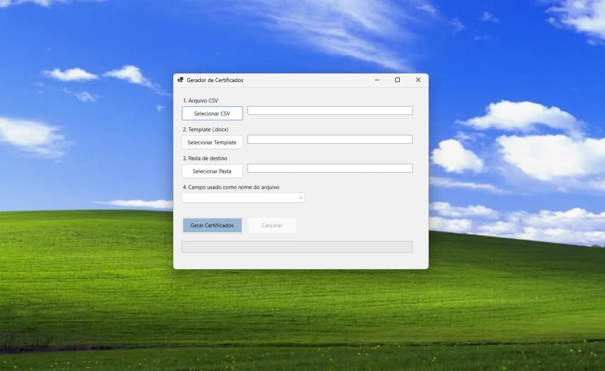
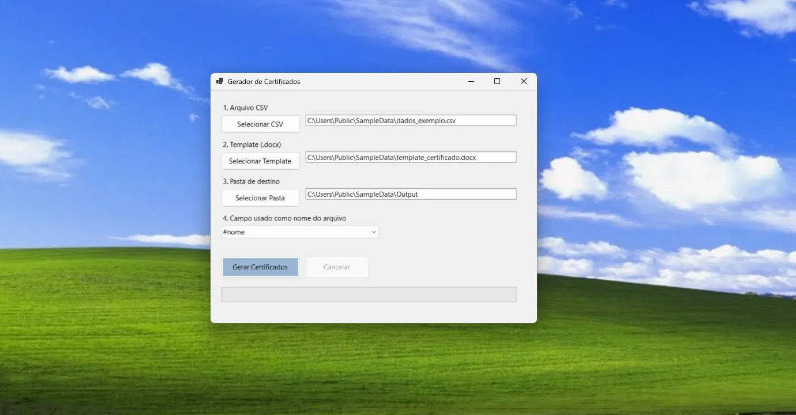
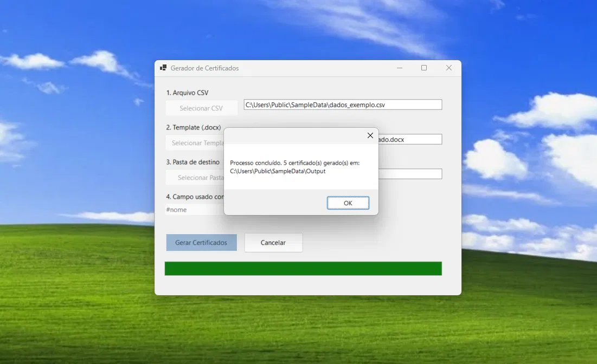
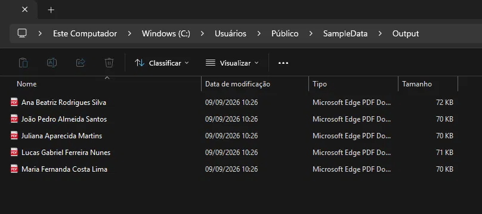
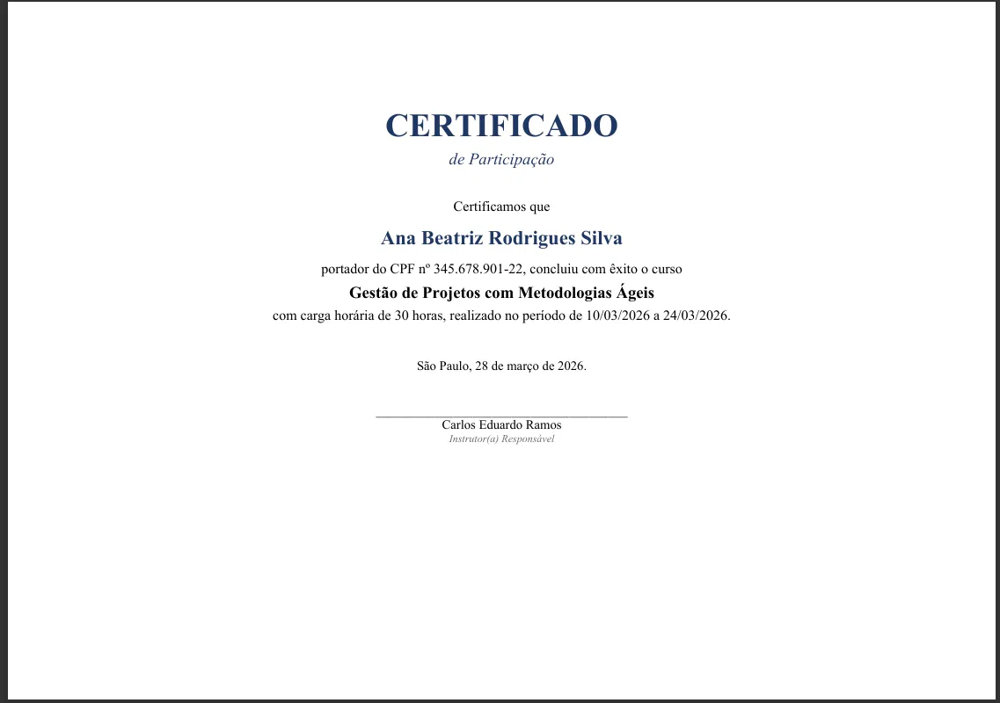

# CertGerador

> Read this in [English](README.en.md).

Aplicação desktop em **.NET / C# (Windows Forms)** que gera certificados em lote a partir de um template do Word e uma planilha CSV, convertendo cada documento automaticamente para PDF.

Projeto pessoal, reescrito do zero como exercício de arquitetura e boas práticas — sem nenhuma dependência de uma instituição específica: qualquer CSV e qualquer template `.docx` funcionam, desde que os nomes das colunas do CSV coincidam com os marcadores de texto do template.



## Funcionalidades

- Leitura de dados a partir de um arquivo **CSV** (delimitado por `;`), com qualquer conjunto de colunas.
- Preenchimento automático de um **template `.docx`**, substituindo marcadores de texto (ex: `#nome`, `#cpf`) pelos valores de cada linha do CSV.
- Conversão automática de cada documento gerado para **PDF**.
- Escolha, via combo box, de **qual coluna do CSV** deve nomear cada arquivo de saída.
- Processamento em lote **assíncrono e cancelável**, com barra de progresso.

## Capturas de tela

| Configuração | Processamento | Resultado |
|---|---|---|
|  |  |  |

Exemplo de certificado gerado a partir do template e dos dados de exemplo:



## Como usar

1. Selecione o **arquivo CSV** com os dados (uma linha por certificado).
2. Selecione o **template `.docx`**, com marcadores de texto correspondentes aos nomes das colunas do CSV (ex: coluna `#nome` → marcador `#nome` no documento).
3. Selecione a **pasta de destino** onde os PDFs serão salvos.
4. Escolha, no combo box, **qual coluna** será usada para nomear cada arquivo gerado.
5. Clique em **Gerar Certificados**.

## Dados de exemplo

A pasta [`SampleData/`](CertGerador/SampleData) contém um template (`template_certificado.docx`) e um CSV (`dados_exemplo.csv`) com dados **fictícios**, prontos para testar a aplicação sem precisar de nenhum dado real. Os nomes das colunas do CSV já correspondem aos marcadores do template.

## Arquitetura

O projeto separa responsabilidades por interfaces, mesmo mantendo um único projeto WinForms (decisão deliberada — ver seção abaixo):

```
CertGerador/
├── Interfaces/     # Contratos dos serviços (ICertificateDataSource, ICertificateDocumentBuilder, IDocumentConverter)
├── Models/         # DTOs (CertificateRecord, BatchSettings, CertificateResult)
├── Services/       # Implementações concretas (CsvHelper, OpenXML SDK, FreeSpire.Doc)
├── SampleData/     # Template e CSV de exemplo, para testes
└── Form1.cs        # UI — delega toda a lógica para os serviços via interface
```

- **Leitura de CSV**: [CsvHelper](https://joshclose.github.io/CsvHelper/).
- **Geração do `.docx`**: [Open XML SDK](https://github.com/dotnet/Open-XML-SDK) (biblioteca oficial da Microsoft, sem restrições de licenciamento).
- **Conversão para PDF**: [FreeSpire.Doc](https://www.e-iceblue.com/Introduce/free-doc-component.html).
- **Concorrência**: `async`/`await` com `Task.Run`, `IProgress<T>` para progresso e `CancellationToken` para cancelamento — em vez do `BackgroundWorker` (padrão pré-`async`), usado na primeira versão deste projeto.

### Por que um único projeto WinForms, em vez de múltiplos projetos (Core/Infrastructure/UI)?

Foi uma decisão consciente. Uma arquitetura em camadas com projetos separados (e testes automatizados) traria benefícios reais de testabilidade e reuso, mas para um projeto de portfólio que não será mantido em produção nem executado em CI, o ganho não compensava a fricção extra. Em vez disso, a separação de responsabilidades foi mantida **por pastas e interfaces** dentro do mesmo projeto — o suficiente para demonstrar as decisões de design sem o overhead de múltiplos assemblies.

## Como rodar

Pré-requisitos: .NET 10 SDK, Windows (WinForms não roda em outras plataformas).

```bash
git clone https://github.com/TheuZN/certGerador.git
cd certGerador
dotnet build
dotnet run --project CertGerador
```

## Sobre este projeto

Esta é uma reescrita de um projeto originalmente desenvolvido durante um estágio, agora generalizado e sem qualquer vínculo com a instituição original: nenhum dado real, nenhuma marca, nenhuma integração específica permanece no código — o gerador funciona com qualquer template e qualquer CSV.

## Licença

Distribuído sob a licença MIT. Veja [LICENSE](LICENSE) para mais detalhes.
